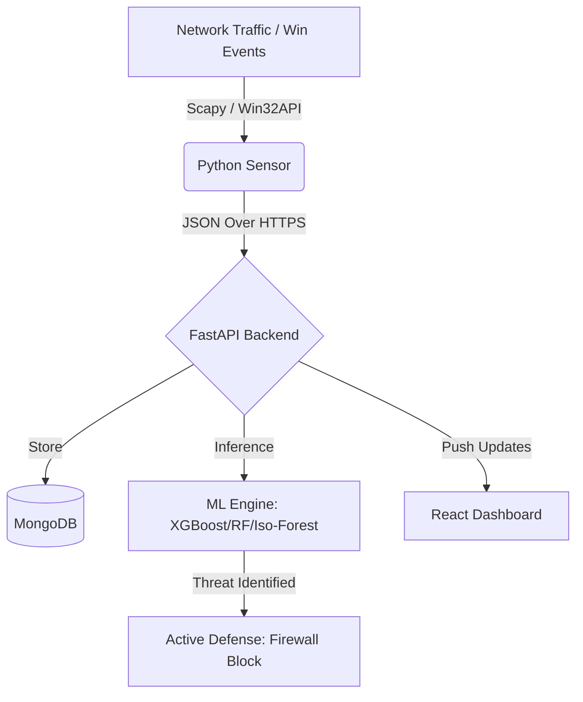

# 🛡️ SIEM-OS Professional
**The Next-Generation AI-Driven Security Information and Event Management System**

---

### *Bridging the gap between reactive logging and proactive defense.*
[Overview](#-overview) • [Key Features](#-key-features) • [Architecture](#-architecture)

## 📖 Overview
**SIEM-OS Professional** is a high-performance, full-stack security platform designed to automate threat detection and response. By combining **Deep Packet Inspection (DPI)** with advanced **Gradient Boosting Algorithms (XGBoost)**, it identifies malicious patterns in real-time and executes active defense measures, such as automated firewall blocking.

---

## ✨ Key Features

#### 🧠 **AI-Powered Detection**
- **Hybrid ML Models:** Utilizes XGBoost, Random Forest, and Isolation Forest for high-precision classification.
- **Traffic Fingerprinting:** Analyzes packet size, flow duration, and request frequency to detect DoS/DDoS and Brute Force attacks.

#### 🛰️ **Intelligent Sensors**
- **DPI Sniffer:** Custom-built Python sniffer using `Scapy` for real-time network layer inspection.
- **Host Monitoring:** Integrated Windows Security Event Log tracking.
- **Honeypot Logic:** Monitors high-risk ports (FTP, SSH, SMB) to trap and log early-stage reconnaissance.

#### 🛡️ **Active Response**
- **Dynamic Firewall Sync:** Automatically pushes malicious IPs detected by AI to the Windows Firewall via `netsh` integration.
- **Instant Alerts:** Real-time push notifications via the `ntfy` protocol.

#### 📊 **Security Operations Center (SOC) Dashboard**
- **Live Visualization:** Real-time threat maps and traffic distribution charts using `Recharts`.
- **Forensic Lab:** Deep-dive into historical logs with advanced filtering and metadata exploration.

🛠️ Tech Stack
- **Frontend:** React.js, Tailwind CSS, Lucide Icons, Recharts.

- **Backend:** FastAPI (Python), Motor (Async MongoDB Atlas), JWT Auth.

- **Machine Learning:** XGBoost, Scikit-Learn, Pandas, NumPy.

- **Network:** Scapy, Win32EvtLog.

---

## 🏗️ Architecture

